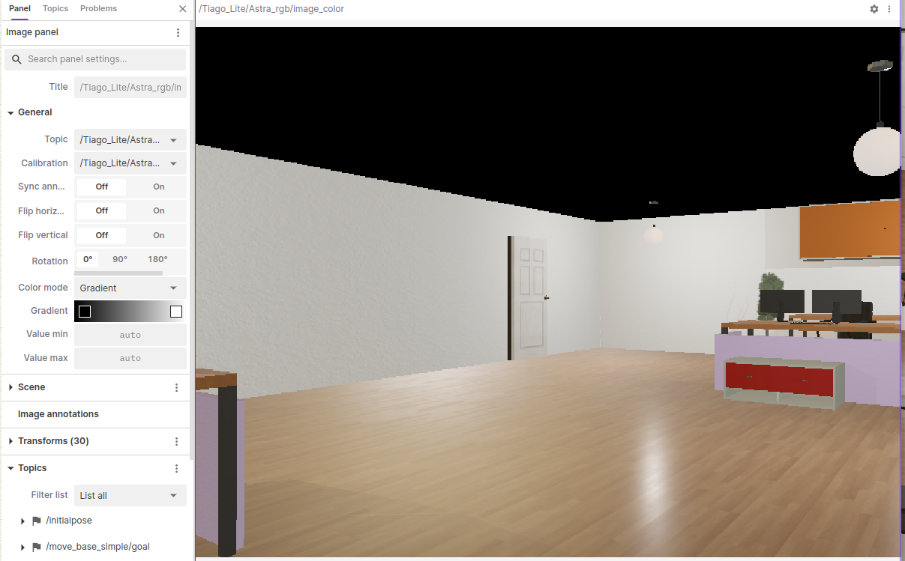

# ROS2 Autonomous Navigation with Multi-Agent VLA (Qwen2.5-VL)

This repository contains an advanced **ROS2 Humble** node that enables a **TIAGo** robot to navigate autonomously in **Webots** using a Multi-Agent Vision-Language-Action (VLA) architecture. 

The system bridges high-level semantic reasoning with low-level robotic control, utilizing the **Qwen2.5-VL** multimodal model for real-time decision-making and trajectory correction.

## 🤖 System Architecture

Unlike traditional navigation stacks, this implementation uses a **Multi-Agent Pipeline** to decouple perception from control logic:

1. **Agent 1 (The Observer):** Performs semantic scene analysis on the full camera FOV. It localizes the target (white door) and identifies potential collisions in the central path.
2. **Agent 2 (The Pilot):** Translates the semantic report into numerical control setpoints (Steering Error & Speed Factors).
3. **Motion Controller:** A Proportional Controller (P-Control) that translates AI setpoints into smooth `geometry_msgs/Twist` commands.

### Key Features:
* **Full FOV Perception:** Zero-shot target detection across the entire frame, allowing for peripheral awareness.
* **Semantic P-Control:** Proportional steering based on AI-estimated error signals.
* **Velocity Profiling:** Dynamic linear speed adjustment based on steering intensity to ensure robotic stability during sharp turns.
* **Fixed Spin Search:** Robust exploration state that performs a constant scan when the target is out of sight.


## 🛠️ Tech Stack
* **Robotics:** ROS2 Humble / Webots R2023b
* **AI/VLA:** Qwen2.5-VL-7B-Instruct (via HuggingFace Inference API)
* **Control:** Proportional Control (P-Control) with Velocity Profiling
* **Vision:** OpenCV & CvBridge for real-time image processing

## 🚀 Setup & Execution

1. **Environment Setup:**
   ```bash
   source /opt/ros/humble/setup.bash
   export HF_API_KEY="your_huggingface_key_here"

2. **Launch Webots Simulation:**
   ```bash
   ros2 launch webots_ros2_tiago robot_launch.py
   ```
   
3. **Start Visualization (Optional)**:   
   ```bash
   ros2 run foxglove_bridge foxglove_bridge
   ```
   Then, open the Foxglove Studio and connect to localhost.

4. **Run the AI Navigator Node:**
   ```bash
   python3 tiago_vla_multi_agent_navigator.py
   ```
## 🖼️ Simulation Environment & Perception

The following snapshots illustrate the simulation setup in **Webots** and the real-time data visualization via **Foxglove Studio**.

| Webots Global View | Foxglove AI Perception |
|:---:|:---:|
|  |  |

*Left: The TIAGo robot in the office environment aiming for the white door. Right: Real-time camera feed used for VLA reasoning.*

## 🎥 Logic Flow & Control Theory

The node implements a **closed-loop feedback system** that bridges high-level AI reasoning with low-level robotic actuation:

1. **Perception**: Captures full RGB frames from the robot's camera and encodes them to **Base64** for VLM processing.
2. **Reasoning**: 
    * **Observer Agent**: Analyzes the scene and provides localized semantic context (e.g., target door position).
    * **Pilot Agent**: Processes the context and generates a normalized Steering Error $e \in [-1, 1]$.
3. **Control (P-Law)**:
    * **Angular Velocity ($Z$ axis)**: $\omega = -1.0 \times K_p \times e$
    * **Linear Velocity ($X$ axis)**: $V = V_{max} \times \text{SpeedFactor} \times (1 - |e| \times 0.6)$
4. **Actuation**: Publishes continuous `geometry_msgs/Twist` commands to the `/cmd_vel` topic.


    
